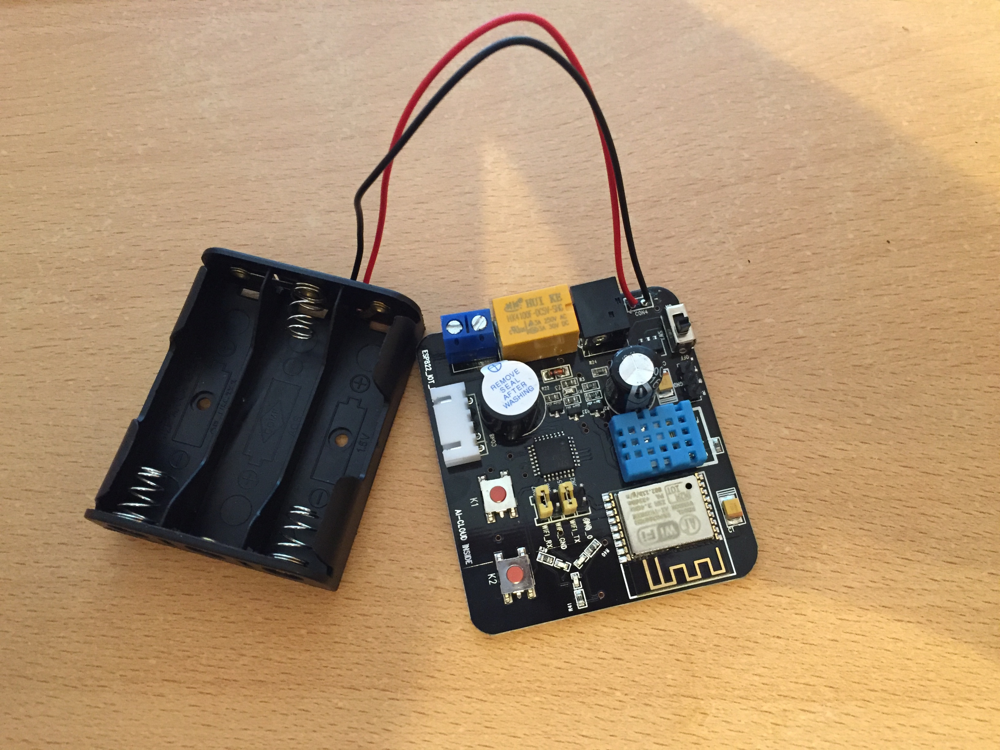

# Homie Test Board T5
This repo consists of my first attempt to let [homie-esp8266](https://github.com/marvinroger/homie-esp8266) from [Marvin Roger](https://github.com/marvinroger) run on Beta Test Board Black Board T5 ESP-13.

You can order these boards on [Amazon](https://www.amazon.de/dp/B017DAPPDQ).

[Darryl Bond](https://github.com/darrylb123) has collected some useful information on the [inner workings of the board](https://github.com/darrylb123/BetaBlackT5) and the [STC15L2K32S microcontroller](https://github.com/darrylb123/blackboard-STC15).

This is how the board looked unmodified: 

And here I removed the disturbing beeper and connected RX/TX to my USB-TTL connector so I could eavesdrop the communication between both chips: 
